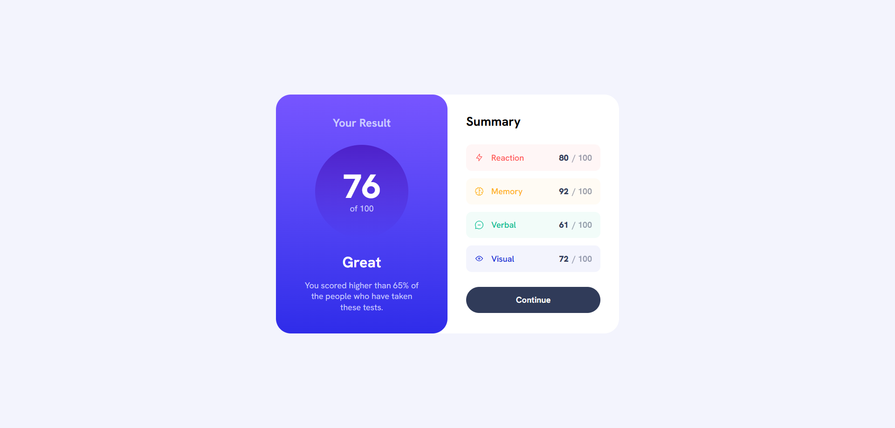

<h1 align="center">Results summary component</h1>

Solution to the Frontend Mentor challenge

  

This is a solution to the [Results summary component challenge on Frontend Mentor](https://www.frontendmentor.io/challenges/results-summary-component-CE_K6s0maV). Frontend Mentor challenges help you improve your coding skills by building realistic projects.

## Screenshot

Desktop view (1920px wide)

## Features

Users should be able to:
- See hover and focus states for all interactive elements on the page

## Built with

- HTML
- CSS
- JavaScript
- JSON data

## Links

- Solution URL: https://www.frontendmentor.io/solutions/results-summary-component-7Db-AS3D5o
- Live Site URL: https://resultssummarycomp-abe.netlify.app

## Author

Find me on other platforms!

- Frontend Mentor: [@AverageBaguetteEnjoyer](https://www.frontendmentor.io/profile/AverageBaguetteEnjoyer)
- CodeWars: [AverageBaguetteEnjoyer](https://www.codewars.com/users/AverageBaguetteEnjoyer)
- Coddy: [@baguetteenjoyer](https://coddy.tech/user/baguetteenjoyer?via=share_profile)